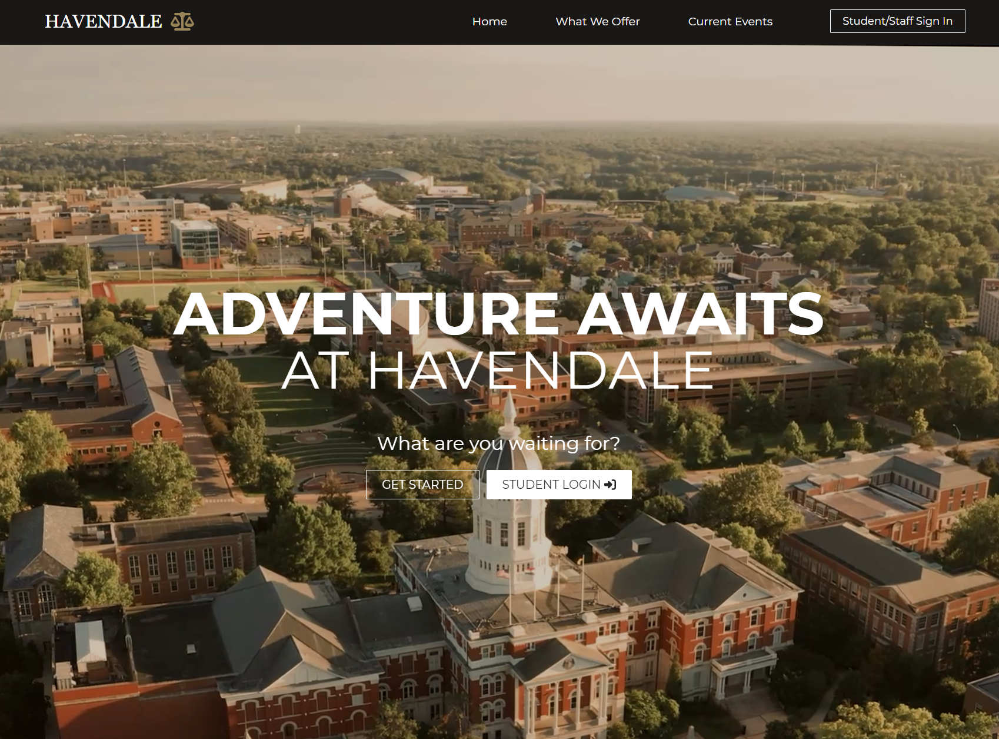
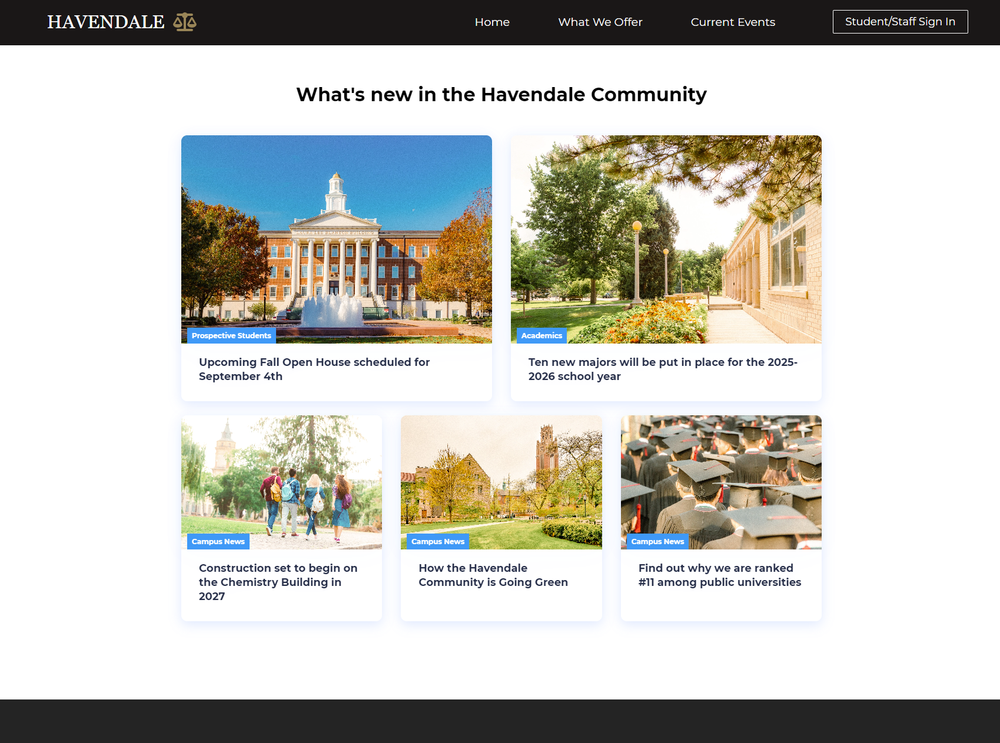
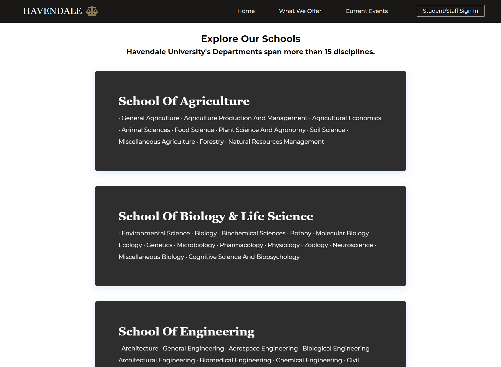
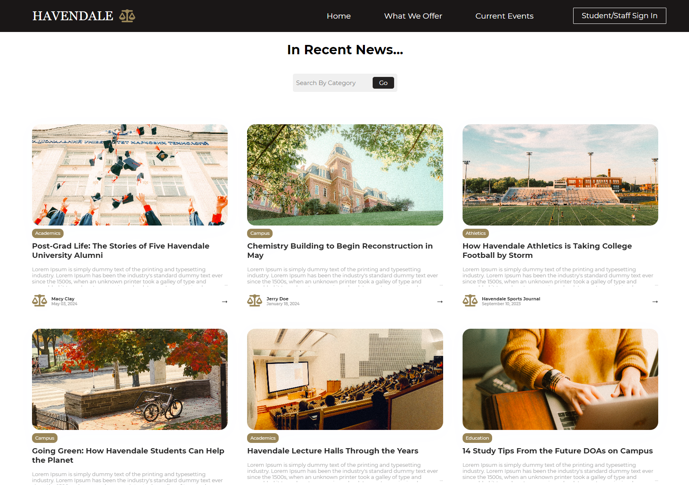
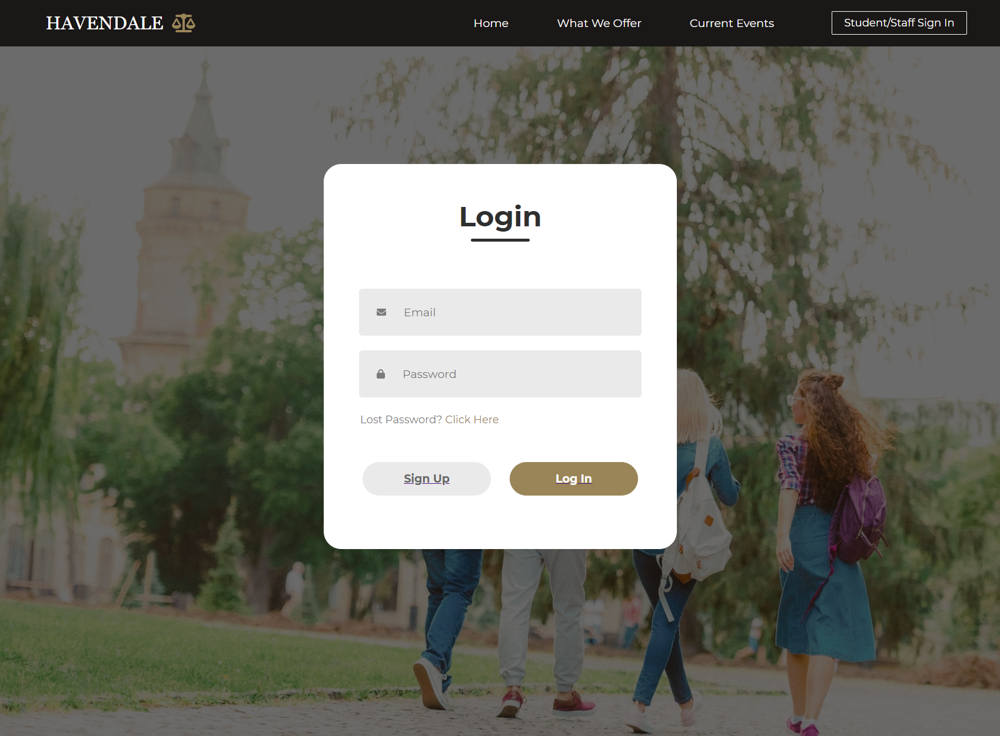

# Preview Images

Home Page - with video Hero section

Home Page - below Hero section with clickable and animated cards

Academics Page - with list and cards created by parsing CSV file

Events Page - with working search by category or keyword

Blog Page - displays articles once a user selects them

Login Page - changes whether a user selects Login or Sign Up

  
# How to view the Havendale University React App

This project was bootstrapped with [Create React App](https://github.com/facebook/create-react-app).

In the project directory, you can run:
### `npm start`
Runs the app in the development mode.\
Open [http://localhost:3000](http://localhost:3000) to view it in your browser.
